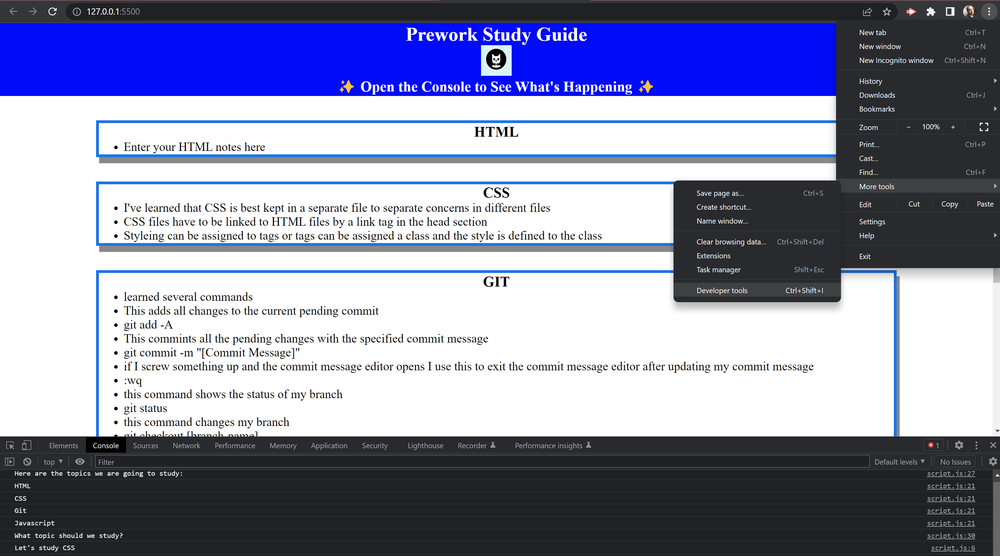

# Prework Study Guide Website

## Description

This was a starter project to get acquainted with the fundementals of how to use Git to manage code, how to create a website from scratch, style it with CSS and make it interactive with Javascript. 

## Installation

n/a this project doesn't require installation

## Usage

You can add notes to the different things learned about Git, HTML, CSS and Javascript.
Then you can use the dev tools to randomly pick a topic to study some more. 

## Credits

Here are some of the references I used while making this project. 

### Git
    https://education.github.com/git-cheat-sheet-education.pdf
    https://docs.github.com/en/repositories/managing-your-repositorys-settings-and-features/customizing-your-repository/licensing-a-repository
    https://docs.github.com/en/get-started/quickstart/github-flow
### CSS
    https://developer.mozilla.org/en-US/docs/Learn/CSS/Building_blocks/The_box_model

## License

Please see the license saved in the repo.